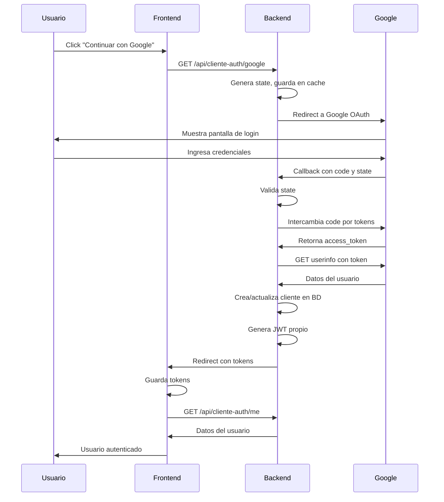

# Requerimientos del Backend para Google OAuth

## Flujo de Autenticación Social con Google

### 1. Configuración de Google Cloud Console

El backend necesita:

1. **Crear un proyecto en Google Cloud Console**
2. **Habilitar Google+ API o Google Identity**
3. **Crear credenciales OAuth 2.0:**
   - Client ID
   - Client Secret
   - Redirect URIs autorizados: 
     - `http://localhost:7000/api/cliente-auth/google/callback`
     - `https://tudominio.com/api/cliente-auth/google/callback`

### 2. Endpoints Requeridos en el Backend

#### **GET `/api/cliente-auth/google`**
Inicia el flujo OAuth redirigiendo a Google.

**Query Parameters:**
- `redirect_uri`: URL del frontend donde retornar después del login
- `empresa_id`: ID de la empresa (1 para Dulce y Salado)

**Flujo:**
1. Recibe la petición del frontend
2. Genera el `state` para seguridad (CSRF protection)
3. Guarda el `state` y `redirect_uri` en sesión/cache
4. Redirige a Google OAuth con:
   ```
   https://accounts.google.com/o/oauth2/v2/auth?
     client_id=YOUR_CLIENT_ID&
     redirect_uri=http://localhost:7000/api/cliente-auth/google/callback&
     response_type=code&
     scope=openid email profile&
     state=GENERATED_STATE&
     access_type=offline&
     prompt=consent
   ```

#### **GET `/api/cliente-auth/google/callback`**
Callback que Google llama después de la autenticación.

**Query Parameters de Google:**
- `code`: Código de autorización
- `state`: Estado para verificación CSRF
- `error`: (opcional) Si hubo un error

**Flujo:**
1. Verificar que el `state` coincida con el guardado
2. Intercambiar el `code` por tokens con Google:
   ```http
   POST https://oauth2.googleapis.com/token
   {
     "code": "authorization_code",
     "client_id": "YOUR_CLIENT_ID",
     "client_secret": "YOUR_CLIENT_SECRET",
     "redirect_uri": "http://localhost:7000/api/cliente-auth/google/callback",
     "grant_type": "authorization_code"
   }
   ```
3. Google responde con:
   ```json
   {
     "access_token": "...",
     "id_token": "...",
     "refresh_token": "...",
     "expires_in": 3600,
     "token_type": "Bearer"
   }
   ```
4. Obtener información del usuario con el `access_token`:
   ```http
   GET https://www.googleapis.com/oauth2/v2/userinfo
   Authorization: Bearer ACCESS_TOKEN
   ```
5. Google responde con:
   ```json
   {
     "id": "google_user_id",
     "email": "user@gmail.com",
     "verified_email": true,
     "name": "Nombre Completo",
     "given_name": "Nombre",
     "family_name": "Apellido",
     "picture": "https://...jpg"
   }
   ```

### 3. Lógica de Negocio en el Backend

1. **Buscar si el usuario existe por email:**
   - Si existe: actualizar datos y hacer login
   - Si no existe: crear nuevo usuario

2. **Crear/Actualizar Cliente:**
   ```csharp
   var cliente = await _context.Clientes
       .FirstOrDefaultAsync(c => c.Email == googleEmail && c.EmpresaId == empresaId);

   if (cliente == null)
   {
       // Crear nuevo cliente
       cliente = new Cliente
       {
           Codigo = GenerateUniqueCode(),
           Nombre = googleName,
           Email = googleEmail,
           EmpresaId = empresaId,
           ListaPrecioId = GetDefaultPriceList(empresaId),
           GoogleId = googleId,
           FotoUrl = googlePicture,
           EmailVerificado = true,
           FechaRegistro = DateTime.Now
       };
       _context.Clientes.Add(cliente);
   }
   else
   {
       // Actualizar datos del cliente
       cliente.GoogleId = googleId;
       cliente.FotoUrl = googlePicture;
       cliente.UltimoAcceso = DateTime.Now;
   }

   await _context.SaveChangesAsync();
   ```

3. **Generar tokens JWT propios:**
   ```csharp
   var token = GenerateJWT(cliente);
   var refreshToken = GenerateRefreshToken();
   
   // Guardar refresh token en BD
   ```

4. **Redirigir al frontend con los tokens:**
   ```csharp
   var frontendUrl = GetStoredRedirectUri(state);
   var redirectUrl = $"{frontendUrl}?token={token}&refresh_token={refreshToken}";
   return Redirect(redirectUrl);
   ```

### 4. Manejo de Errores

Si hay error en cualquier paso, redirigir al frontend con:
```
http://localhost:5173/auth/google/callback?error=mensaje_de_error
```

### 5. Modelo de Base de Datos Sugerido

Agregar a la tabla `Clientes`:
```sql
ALTER TABLE Clientes ADD COLUMN google_id VARCHAR(255);
ALTER TABLE Clientes ADD COLUMN foto_url TEXT;
ALTER TABLE Clientes ADD COLUMN email_verificado BOOLEAN DEFAULT FALSE;
ALTER TABLE Clientes ADD COLUMN proveedor_auth VARCHAR(50); -- 'google', 'local', etc
```

### 6. Configuración de Ambiente

En `appsettings.json`:
```json
{
  "GoogleAuth": {
    "ClientId": "YOUR_GOOGLE_CLIENT_ID",
    "ClientSecret": "YOUR_GOOGLE_CLIENT_SECRET",
    "RedirectUri": "http://localhost:7000/api/cliente-auth/google/callback"
  }
}
```

### 7. Seguridad

1. **SIEMPRE validar el `state` parameter** para prevenir CSRF
2. **Usar HTTPS en producción**
3. **Validar que el email de Google esté verificado**
4. **Limitar los redirect URIs permitidos**
5. **Implementar rate limiting**

### 8. Flujo Completo



### 9. Testing

Para probar localmente:
1. Configurar Google OAuth con redirect URI local
2. Usar `http://localhost:7000` para el backend
3. Usar `http://localhost:5173` para el frontend
4. Asegurarse de que ambos estén en HTTP o ambos en HTTPS

### 10. Librerías Recomendadas para .NET

```xml
<PackageReference Include="Google.Apis.Auth" Version="1.60.0" />
<PackageReference Include="Microsoft.AspNetCore.Authentication.Google" Version="7.0.0" />
```

O implementación manual con `HttpClient` para más control.