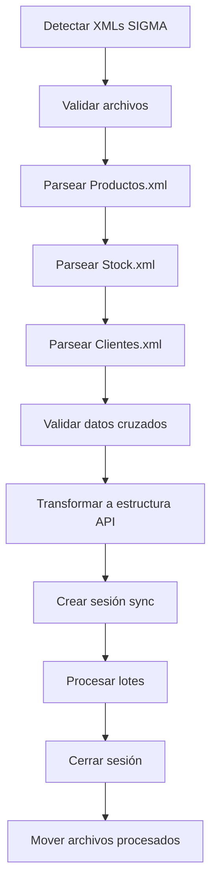

# SPEC: Procesador SIGMA XML para DistriCatalogo

**Autor**: Claude  
**Fecha**: 2025-01-09  
**Estado**: Draft  
**Versión**: 1.0  

## 1. Resumen

### Problema
El cliente necesita procesar archivos XML provenientes del sistema SIGMA (en lugar de GECOM) y sincronizarlos con la API de DistriCatalogo. Los archivos XML tienen una estructura diferente pero deben transformarse a la misma estructura que espera la API actual.

### Solución Propuesta
Desarrollar un nuevo módulo de procesamiento XML que:
- Parse archivos XML de SIGMA (Productos, Stock, Clientes)
- Transforme los datos a la estructura JSON esperada por la API
- Mantenga compatibilidad con el flujo de sincronización existente
- Use empresa única (ID=1) para todos los stocks

### Valor de Negocio
- Soporte para nuevo cliente con sistema SIGMA
- Reutilización de infraestructura API existente
- Flexibilidad para múltiples sistemas fuente

## 2. Análisis de Datos

### 2.1 Archivos de Entrada SIGMA

#### **Productos.xml**
```xml
<ROW fcodigo="4005" 
     artnom="ROTHMANS XL 43/70 BOX" 
     fgrupo="010" grunom="alfajores"
     frubro="0065" rubnom="B.TOBACCO"
     codprov="00232" pronom="BRITISH AMERICAN..."
     fdelete="N"
     flispr2="3.430,00" 
     flispr4="3.430,00"/>
```

#### **Stock.xml**
```xml
<ROW codart="04005" 
     fdescri="ROTHMANS XL 43/70 BOX" 
     fstock="30"/>
```

#### **Clientes.xml**
```xml
<ROW fcodigo="000183" 
     fnombre="PLUS SERVICE SRL"
     flispre="2"
     fcuit="33-64448451-9"
     tipiva="INSCRIPTO"/>
```

### 2.2 Mapeo de Campos (CORREGIDO)

#### **Productos.xml → API**
```
SIGMA Field       → API Field           → Comentarios
------------------------------------------------------------
fcodigo          → codigo               → Código producto
artnom           → nombre, descripcion  → Nombre del producto
fgrupo           → categoria_id         → CATEGORÍA (no frubro!)
grunom           → metadata             → Nombre de categoría
frubro           → grupo2               → MARCA/RUBRO como grupo2
rubnom           → metadata             → Nombre del rubro/marca
codprov          → (no usado aún)       → Código proveedor
fdelete          → activo               → N=true, S/Y=false
flispr2          → listas_precios[0]    → Lista precio 2→1
flispr4          → listas_precios[1]    → Lista precio 4→5
fuxb, fuxd       → (futuro)             → Unidades bulto/display
fcanmin          → (futuro)             → Cantidad mínima venta
```

#### **Stock.xml → API**
```
SIGMA Field       → API Field           → Comentarios
------------------------------------------------------------
codart           → codigo               → Match con productos
fstock           → stocks_por_empresa   → [{"empresa_id":1,"stock":valor}]
fdescri          → (validación)         → Verificar coincidencia
```

### 2.3 Campos Calculados/Defaults

| Campo API | Valor | Fuente |
|-----------|--------|---------|
| `grupo1` | `null` | No usado aún |
| `grupo3` | `null` | No usado aún |
| `imputable` | `"S"` | Default (visible) |
| `disponible` | Calculado | De `fdelete` |
| `fecha_alta` | `DateTime.Now` | Fecha procesamiento |
| `fecha_modi` | `DateTime.Now` | Fecha procesamiento |
| `codigo_ubicacion` | `null` | No disponible |
| `porcentaje` | Calculado | Diferencia entre listas |

## 3. Arquitectura Técnica

### 3.1 Nuevos Componentes

```
/Models/Sigma/
├── SigmaProduct.cs        # Modelo producto SIGMA
├── SigmaStock.cs          # Modelo stock SIGMA  
├── SigmaClient.cs         # Modelo cliente SIGMA
└── SigmaProcessConfig.cs  # Configuración procesamiento

/Services/Sigma/
├── SigmaXmlProcessor.cs        # Coordinador principal
├── SigmaProductProcessor.cs    # Procesador productos
├── SigmaStockProcessor.cs      # Procesador stocks
├── SigmaDataTransformer.cs     # Transformador a API format
└── SigmaValidator.cs           # Validaciones cruzadas

/Utils/Sigma/
├── XmlStreamParser.cs          # Parser XML optimizado
├── SigmaEncodingHelper.cs      # Manejo encoding
└── SigmaFieldMapper.cs         # Mapeo de campos
```

### 3.2 Configuración

```json
{
  "Processing": {
    "SigmaConfig": {
      "Enabled": true,
      "ProductsFileName": "Productos.xml",
      "StockFileName": "Stock.xml", 
      "ClientsFileName": "Clientes.xml",
      "EmpresaId": 1,
      "PriceListMapping": {
        "2": 1,  // SIGMA Lista 2 → API Lista 1
        "4": 5   // SIGMA Lista 4 → API Lista 5
      },
      "CategoryMapping": {
        "UseGroupAsCategory": true,  // fgrupo → categoria_id
        "UseRubroAsGroup2": true     // frubro → grupo2
      }
    }
  }
}
```

### 3.3 Flujo de Procesamiento



## 4. Especificaciones Técnicas

### 4.1 Interfaces

#### ISigmaProcessor
```csharp
public interface ISigmaProcessor<T>
{
    Task<List<T>> ProcessFileAsync(string filePath, string tempFolder);
    bool ValidateFileStructure(string filePath);
    Task<string> CleanFileAsync(string inputPath, string outputPath);
}
```

#### ISigmaDataTransformer
```csharp
public interface ISigmaDataTransformer
{
    List<ProductWithPricesAndStock> TransformToApiFormat(
        List<SigmaProduct> products,
        List<SigmaStock> stocks,
        SigmaProcessConfig config);
    
    ProductPriceDto MapPriceList(decimal price, int sigmaListId, SigmaProcessConfig config);
    EmpresaStock MapStock(SigmaStock stock, int empresaId);
}
```

### 4.2 Modelos de Datos

#### SigmaProduct
```csharp
public class SigmaProduct
{
    public string fcodigo { get; set; }      // Código producto
    public string artnom { get; set; }       // Nombre
    public string fgrupo { get; set; }       // GRUPO (categoría)
    public string grunom { get; set; }       // Nombre grupo
    public string frubro { get; set; }       // RUBRO (marca)
    public string rubnom { get; set; }       // Nombre rubro
    public string codprov { get; set; }      // Código proveedor
    public string pronom { get; set; }       // Nombre proveedor
    public string fdelete { get; set; }      // Activo (N=activo)
    public decimal fuxb { get; set; }        // Unidades por bulto
    public decimal fuxd { get; set; }        // Unidades por display
    public decimal fcanmin { get; set; }     // Cantidad mínima
    public decimal flispr2 { get; set; }     // Lista precio 2
    public decimal flispr4 { get; set; }     // Lista precio 4
    public string foto { get; set; }         // Tiene foto
}
```

#### SigmaStock
```csharp
public class SigmaStock
{
    public string codart { get; set; }       // Código artículo
    public string fdescri { get; set; }      // Descripción
    public decimal fstock { get; set; }      // Stock actual
}
```

### 4.3 Transformaciones Clave

#### Mapeo de Categorías
```csharp
// CORRECCIÓN: fgrupo es la categoría, no frubro
var categoriaId = ParseInt(sigmaProduct.fgrupo); // "010" → 10
```

#### Mapeo de Precios
```csharp
var listasPrecios = new List<ProductPriceDto>();

if (sigmaProduct.flispr2 > 0)
{
    listasPrecios.Add(new ProductPriceDto 
    {
        ListaId = config.PriceListMapping["2"], // 1
        Precio = sigmaProduct.flispr2,
        Fecha = DateTime.Now
    });
}

if (sigmaProduct.flispr4 > 0)
{
    listasPrecios.Add(new ProductPriceDto 
    {
        ListaId = config.PriceListMapping["4"], // 5  
        Precio = sigmaProduct.flispr4,
        Fecha = DateTime.Now
    });
}
```

#### Mapeo de Stocks
```csharp
var stocksPorEmpresa = new List<EmpresaStock>
{
    new EmpresaStock 
    {
        EmpresaId = config.EmpresaId, // 1
        Stock = sigmaStock.fstock
    }
};
```

## 5. Plan de Implementación

### Fase 1: Infraestructura (3 días)
- [ ] Crear estructura de carpetas y modelos
- [ ] Implementar XmlStreamParser con manejo robusto
- [ ] Configuración SigmaConfig en appsettings
- [ ] Validación de archivos XML

### Fase 2: Procesadores (4 días)  
- [ ] SigmaProductProcessor con mapeo correcto (fgrupo→categoría)
- [ ] SigmaStockProcessor 
- [ ] SigmaDataTransformer con todas las transformaciones
- [ ] Tests unitarios de cada procesador

### Fase 3: Integración (2 días)
- [ ] SigmaXmlProcessor coordinador
- [ ] Integración con Program.cs (detección automática)
- [ ] Manejo de errores y logging
- [ ] Validaciones cruzadas productos-stock

### Fase 4: Testing (2 días)
- [ ] Tests de integración con archivos reales
- [ ] Verificación estructura API correcta  
- [ ] Performance con archivos grandes
- [ ] Documentación de usuario

## 6. Casos de Uso

### 6.1 Procesamiento Normal
```bash
# Input: Productos.xml, Stock.xml, Clientes.xml en /input
dotnet run

# Salida esperada:
=== MODO SIGMA XML DETECTADO ===
Procesando: Productos.xml (1500 items), Stock.xml (1200 items)
Categorías mapeadas: fgrupo → categoria_id
Marcas mapeadas: frubro → grupo2  
Listas de precios: 2→1, 4→5
Productos sincronizados: 1500
Stocks actualizados: 1200
```

### 6.2 Ejemplo Transformación

**Input SIGMA:**
```xml
<ROW fcodigo="4005"
     artnom="ALFAJOR JORGITO" 
     fgrupo="010" grunom="ALFAJORES"
     frubro="0065" rubnom="GEORGALOS"
     flispr2="150,50"
     flispr4="180,00"
     fdelete="N"/>
```

**Output API:**
```json
{
  "codigo": "4005",
  "nombre": "ALFAJOR JORGITO",
  "descripcion": "ALFAJOR JORGITO", 
  "categoria_id": 10,        // fgrupo "010" → 10
  "grupo1": null,            // No usado
  "grupo2": 65,              // frubro "0065" → 65  
  "grupo3": null,            // No usado
  "activo": true,            // fdelete "N" → true
  "visible_catalogo": true,  // Default
  "listas_precios": [
    {"ListaId": 1, "Precio": 150.50},  // flispr2
    {"ListaId": 5, "Precio": 180.00}   // flispr4
  ],
  "stocks_por_empresa": [
    {"empresa_id": 1, "stock": 25}     // De Stock.xml
  ]
}
```

## 7. Validaciones y Reglas de Negocio

### 7.1 Validaciones Obligatorias
- [ ] Código producto único en Productos.xml
- [ ] Stock.codart debe existir en Productos.fcodigo
- [ ] Categorías (fgrupo) deben ser numéricas válidas
- [ ] Precios no pueden ser negativos
- [ ] Stock puede ser 0 o positivo

### 7.2 Reglas de Negocio
- [ ] fdelete="N" significa producto activo
- [ ] Si no hay stock para un producto, usar 0
- [ ] Si precio es 0, no crear entrada en listas_precios
- [ ] Empresa siempre es ID=1 para todos los stocks

## 8. Consideraciones Técnicas

### 8.1 Performance
- Parser XML streaming para archivos >100MB
- Procesamiento en lotes de 500 productos
- Cache de validaciones repetidas

### 8.2 Encoding y Caracteres
- XMLs pueden usar `&#160;` (espacio no separable)
- Manejar encoding Windows-1252/UTF-8
- Normalizar caracteres especiales

### 8.3 Manejo de Errores
- Log detallado de productos con errores de mapeo
- Continuar procesamiento si algunos productos fallan
- Reportar estadísticas de éxito/error

## 9. Criterios de Aceptación

### 9.1 Funcionales
- [ ] Procesa correctamente archivos XML SIGMA
- [ ] Mapea fgrupo a categoria_id (NO frubro)  
- [ ] Mapea frubro a grupo2
- [ ] Transforma precios flispr2/flispr4 a listas API
- [ ] Asigna stocks a empresa_id=1
- [ ] Mantiene compatibilidad con flujo API existente

### 9.2 No Funcionales  
- [ ] Procesa 1000 productos en <30 segundos
- [ ] Maneja archivos XML hasta 50MB
- [ ] Log detallado de transformaciones
- [ ] Tests unitarios >80% cobertura

## 10. Riesgos y Mitigaciones

| Riesgo | Probabilidad | Impacto | Mitigación |
|--------|--------------|---------|------------|
| Cambio estructura XML | Media | Alto | Validación de esquema |
| Encoding incorrecto | Alta | Medio | Detección automática |
| Códigos duplicados | Baja | Alto | Validación estricta |
| Performance archivos grandes | Media | Medio | Streaming XML |

## 11. Definición de Completado

- [ ] Todos los tests pasan
- [ ] Procesamiento exitoso con archivos reales cliente
- [ ] Documentación técnica completa
- [ ] Mapeo correcto verificado: fgrupo→categoría, frubro→grupo2
- [ ] Performance aceptable (<30s para 1000 productos)
- [ ] Code review aprobado
- [ ] Deploy en ambiente desarrollo exitoso

---

**Estimación**: 10-12 días  
**Prioridad**: Alta  
**Dependencias**: API DistriCatalogo funcional  
**Siguiente paso**: Aprobación de spec y inicio Fase 1